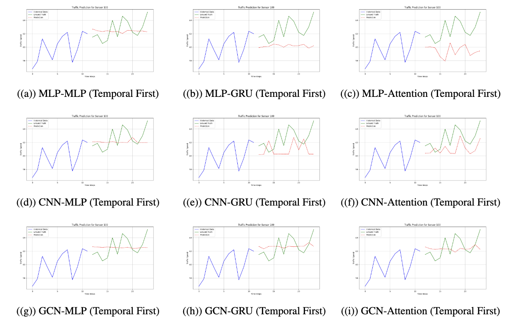

# 交通规划与政策论文

> **论文地址**: [arXiv链接](TrafficFlow.pdf)  
> **代码仓库**: [GitHub链接](https://github.com/zhuchichi56/TFTOOLKITS)

---

## 📚 **简介**

交通流量预测在智能交通系统（ITS）中至关重要，面临 **复杂时空依赖** 和 **非线性交互** 等挑战。  
我们提出了 **\textsc{TFToolkits}** 框架，通过 **时间混合**、**空间混合** 和 **时空融合** 三大模块分解预测任务，兼具灵活性与高效性。  

核心特性：
- 🌟 **模块化设计**：支持不同网络模块组合，满足多种场景需求。
- 🚀 **性能提升**：在多数据集上取得最新最优结果。
- 🛠️ **高扩展性**：适合大规模交通预测任务，便于开发者部署和复现。

---

## 🖼️ **可视化**

### 1. **时间依赖图**


### 2. **空间依赖图**


---

## 📊 **实验结果**

### **1. 模块对比分析**
以下为不同模块在 METR-LA 数据集上的性能对比：

| 模块            | 子模块     | MAE   | RMSE  | MAPE  |
|----------------|----------|-------|-------|-------|
| **时间处理器**    | RNN      | 6.24  | 11.70 | 16.4% |
|                | CNN      | 6.10  | 11.52 | 16.0% |
|                | Attention | **5.78**  | **11.04** | **15.2%** |
| **空间处理器**    | MLP      | 6.16  | 11.64 | 16.2% |
|                | CNN      | 5.90  | 11.30 | 15.6% |
|                | GCN      | **5.74**  | **10.96** | **15.0%** |
| **时空融合策略**  | Cross    | 5.84  | 11.16 | 15.4% |
|                | TS-first | 5.70  | 10.90 | 14.8% |
|                | ST-first | **5.56**  | **10.64** | **14.4%** |

---

### **2. 模型整体性能对比**
我们在 METR-LA 和 PeMSD7 数据集上与其他方法进行了比较：

| 模型             | MAE (METR-LA) | RMSE (METR-LA) | MAPE (METR-LA) | MAE (PeMSD7) | RMSE (PeMSD7) | MAPE (PeMSD7) |
|-----------------|---------------|----------------|----------------|--------------|---------------|---------------|
| DCRNN          | 5.54          | 10.76          | 14.6%          | 4.74         | 8.42          | 11.4%         |
| STGCN          | 5.76          | 11.48          | 15.2%          | 4.50         | 8.08          | 10.8%         |
| Graph WaveNet  | 5.38          | 10.30          | 13.8%          | 4.28         | 7.70          | 10.2%         |
| AGCRN          | 5.30          | 10.22          | 13.6%          | 4.24         | 7.62          | 10.0%         |
| **\mname**      | **5.16**      | **9.96**       | **13.0%**      | **4.10**     | **7.44**      | **9.6%**      |

---

### **3. 消融实验**
为了验证每个组件的重要性，我们对模型的关键模块进行了消融分析：

| 模型变种           | MAE   | RMSE  | MAPE  |
|------------------|-------|-------|-------|
| 完整模型          | **5.16**  | **9.96**  | **13.0%** |
| 无时间混合模块    | 5.90  | 11.24 | 15.6% |
| 无空间混合模块    | 5.76  | 10.90 | 15.0% |
| 无时空融合模块    | 5.64  | 10.70 | 14.6% |

---

## 🔧 **实现细节**

- **框架**：使用 PyTorch 实现，支持模块化替换。
- **环境**：NVIDIA RTX 4090 GPU，批量大小 50。
- **优化器**：Adam（学习率 3e-4，权重衰减 5e-5）。
- **数据集**：
  - METR-LA: 207 个传感器，采样间隔 5 分钟。
  - PeMSD7: 228 个传感器，采样间隔 5 分钟。

---

## 📥 **使用指南**

```bash
python train_lightly.py 
```


## **引用**
如果您在研究中使用了本代码或方法，请引用我们的论文：

```bibtex
@article{tftoolkits2025,
  title={\textsc{TFToolkits}: A Modular Framework for Spatial-Temporal Traffic Flow Prediction},
  author={Zhu, He},
  journal={arXiv preprint arXiv:xxx},
  year={2025}
}
